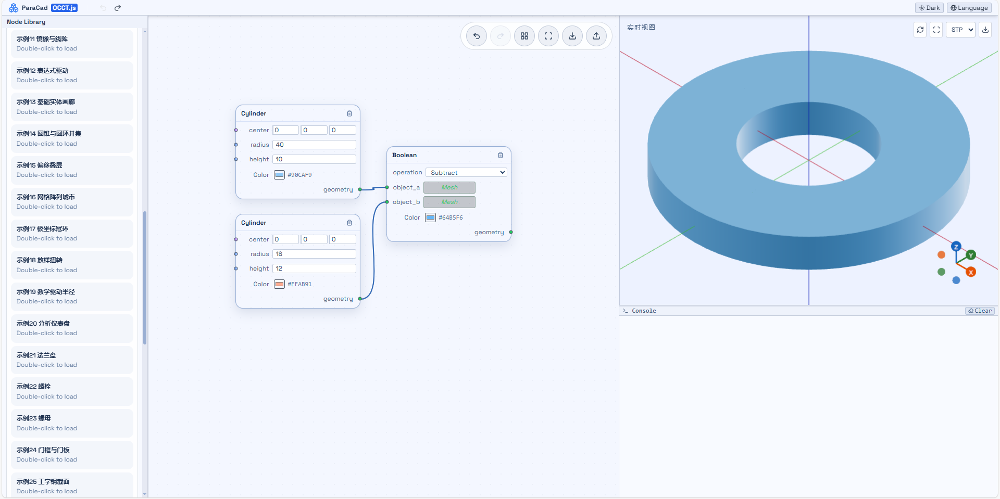
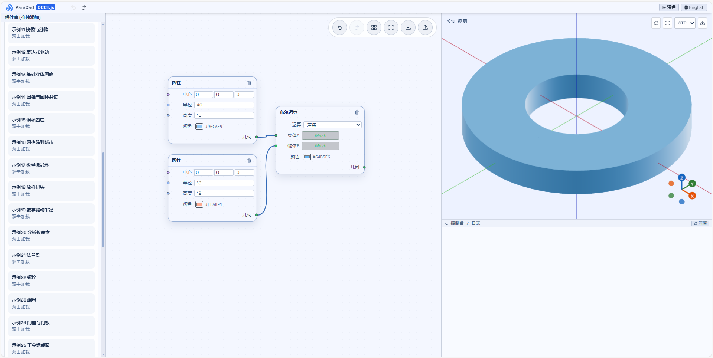

# ParaCad - Node-Based Web Parametric Modeling

ParaCad is a browser-based, node-driven parametric modeling platform built with React and Three.js, with OCCT.js integration for CAD-oriented workflows.

## Features
- Node graph workflow: parameters -> primitives -> features -> transforms -> result
- OCCT.js + Three.js hybrid runtime
- Real-time viewport with model preview and logs
- Example scripts library (load by double-click)
- Light/Dark global theme switch
- Multi-format export: `GLB`, `OBJ`, `STP`, `IGS`

## Quick Start
1. Install dependencies: `npm install`
2. Start dev server: `npm run dev`
3. Open: `http://localhost:5173`
4. Build production: `npm run build`
5. Preview build: `npm run preview`

Recommended environment: Node.js 18+

## Export Notes
- `GLB/OBJ` export from rendered meshes.
- `STP/IGS` prefers original OCCT Shape export.
- If no OCCT Shape exists in current output, ParaCad falls back to faceted mesh-to-OCCT conversion for `STP/IGS`.
- For best CAD fidelity, use OCCT geometry nodes in your graph.

## Screenshots



## Project Structure
```text
paracad/
├── components/         # Node editor and viewport UI
├── core/               # Kernel and graph execution logic
├── store/              # Graph state and history
├── utils/              # Layout, export, geometry helpers
├── public/             # Example scripts and static assets
├── docs/               # Architecture, roadmap, commit guide
├── App.tsx             # App shell
└── index.tsx           # React entry
```

## Docs
- Architecture: `docs/architecture.md`
- Development plan: `docs/plan.md`
- Git commit convention: `docs/git-commit.md`

---

# ParaCad - 基于节点的 Web 参数化建模平台

ParaCad 是一个运行在浏览器中的节点式参数化建模平台，基于 React + Three.js 构建，并集成 OCCT.js 用于 CAD 场景。

## 功能特性
- 节点工作流：参数 -> 图元 -> 特征 -> 变换 -> 结果
- `OCCT.js + Three.js` 混合执行架构
- 实时三维预览与日志联动
- 示例脚本分组（双击可直接加载）
- 浅色/深色全局主题切换
- 多格式导出：`GLB`、`OBJ`、`STP`、`IGS`

## 快速开始
1. 安装依赖：`npm install`
2. 启动开发：`npm run dev`
3. 访问地址：`http://localhost:5173`
4. 生产构建：`npm run build`
5. 构建预览：`npm run preview`

建议使用 Node.js 18+ 环境。

## 导出说明
- `GLB/OBJ` 基于渲染网格导出。
- `STP/IGS` 会优先使用原始 OCCT Shape 导出。
- 若当前结果不含 OCCT Shape，系统会自动回退为网格三角面转 OCCT 后导出 `STP/IGS`。
- 若追求 CAD 精度，建议使用 OCCT 几何节点建模后再导出。

## 截图


## 目录结构
```text
paracad/
├── components/         # 节点编辑器与视口界面
├── core/               # 内核与图执行逻辑
├── store/              # 图状态与历史管理
├── utils/              # 布局、导出、几何工具
├── public/             # 示例脚本与静态资源
├── docs/               # 架构、计划、提交规范
├── App.tsx             # 应用入口壳
└── index.tsx           # React 渲染入口
```

## 相关文档
- 架构文档：`docs/architecture.md`
- 开发计划：`docs/plan.md`
- Git 提交规范：`docs/git-commit.md`
